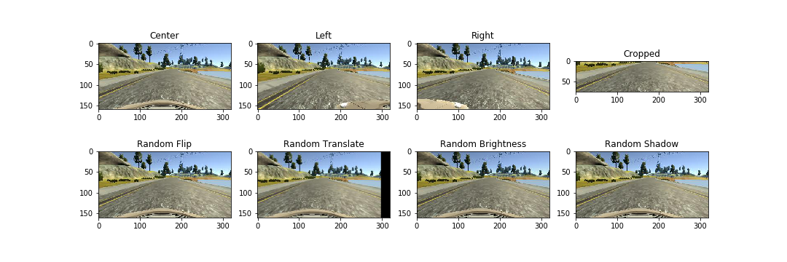
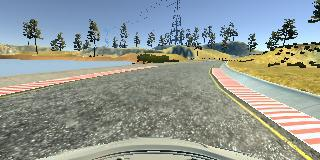

# Behavioral Cloning Project

[](http://www.udacity.com/drive)

Overview
---
This repository contains files for the Behavioral Cloning Project
which demonstrates the power of deep neural networks and convolutional neural networks to clone driving behavior. Keras was used to train, validate and test an optimal driving model. The model will output a steering angle to an autonomous vehicle.

Structure
* `model.py` (script used to create and train the model)
* `utils.py` (script used to support model.py)
* `drive.py` (script to drive the car)
* `model.h5` (a trained Keras model)
* `vid/final.mp4` (a video of vehicle driving autonomously around the track for at least one full lap)

Credit to the Udacity team for the resources. Probably 

Preprocessing
---
### 1) Image processing pipeline

Inspired from [@naokishibuya](https://github.com/naokishibuya/car-behavioral-cloning), the processing pipeline supports the model definition and adds
diversity to the training dataset. The result is detailed below

* Center: the main camera frame
* Left: the left camera frame. For this angle, steering angle needs to be added
* Right: the right camera frame. For this angle, steering angle needs to be subtracted
* Cropped: this step eliminates the sky and car hood out of the camera frame. These noises are not helpful to guide the car on track
* Random Flip: standard flip
* Random Translate: translate by a magnitude of x and y
* Random Brightness
* Random Shadow




In training, all the effects and their intensities are randomized with < 0.5 probability to retain the original context.

### 2) Generator

Located in `utils.py`, the `batch_generator` will process the images and crunch them out in batches. Using Python generator which acts as a co-routine, this segment saves memory and makes the training operations more efficient.

The training batch is randomly sampled from the total training set by `df.sample(batch_size)`. Augmentation techniques only applied during training,
*not during validation/test*

``` python
# Generator function
batch_size = config.get('batch_size', 64)

while 1:
    feats = np.zeros((batch_size, IMAGE_HEIGHT, IMAGE_WIDTH, IMAGE_CHANNELS))
    responses = np.zeros((batch_size))
    
    batch_image = image_df.sample(batch_size)
    batch_steer = steering_df[batch_image.index].reset_index(drop=True)
    batch_image.reset_index(inplace=True, drop=True)
    
    for i, row in batch_image.iterrows():
        if is_training:
            feats[i, :, :, :], responses[i] = image_pipeline(data_dir, row, batch_steer[i], augment=True, **config)
        else:
            feats[i, :, :, :], responses[i] = image_pipeline(data_dir, row, batch_steer[i], augment=False, **config)
            
    yield feats, responses
```

### 3) Collect additional data

I drove the track twice, one in anti-clockwise and turned around to go clockwise. This adds more diversity to the camera angles to be captured. One of the main tricks to teach the car to drive well is recovery from a hard or bad turns. In my additional data collection, I intentionally made bad turns and recover with sharp steers m


Train
---
### 1) Model definition

Below is the model parameters summarized by Keras `model.summary()`. This is based on the [Nvidia model](https://devblogs.nvidia.com/parallelforall/deep-learning-self-driving-cars/) that has been successful in self-driving tests. There are 252,219 weights parameters to train.

Layer types:
* Convolution layers: capture the image context and spatial dimensions. The activation function used was `elu`
* Dropout layer: set the probability at 0.5 to reduce overfitting
* Fully-connected layers: set for the final few layers to compute loss


### 2) Training operations

A few training features were used

* Train/validation split: standard 80-20 
* Adam optimizer: default LR to be 0.0001 and decay rate to be 0.01 as declared in Keras 
``` python 
Adam(lr=config.get('lr', 0.0001), decay=config.get('decay', 0.01))
```
* Keras callbacks: set to capture all epoches because validation performance is unreliable
* `fit_generator()` is called to utilize customized generators defined in `utils.py`

### 3) Hyperparameters

* Correction factor for left/right driving images: currently set at 0.2


Result
---
Observations:
* Reduction in validation loss does not translate to better autonomous driving. Because of that, callbacks need to be set for every single epoch.
The later epoch tends to have better performance because the training set might have been shuffled to difficult turns.


### 1) [Early Epoch Video](vid/early.mp4)

As shown, the car could not make the first turn and end up on the grass.


### 2) [Mid Epoch Video](vid/mid.mp4)

As shown, the car was able to complete about 70% of the track, but ended up in the river. Possible explanation is that the driving sample for that
particular segment might have not been shown to the model.


### 3) [Late/Final Epoch Video](vid/final.mp4)

As shown, the car completed the track and final video is in `vid/final.mp4`




